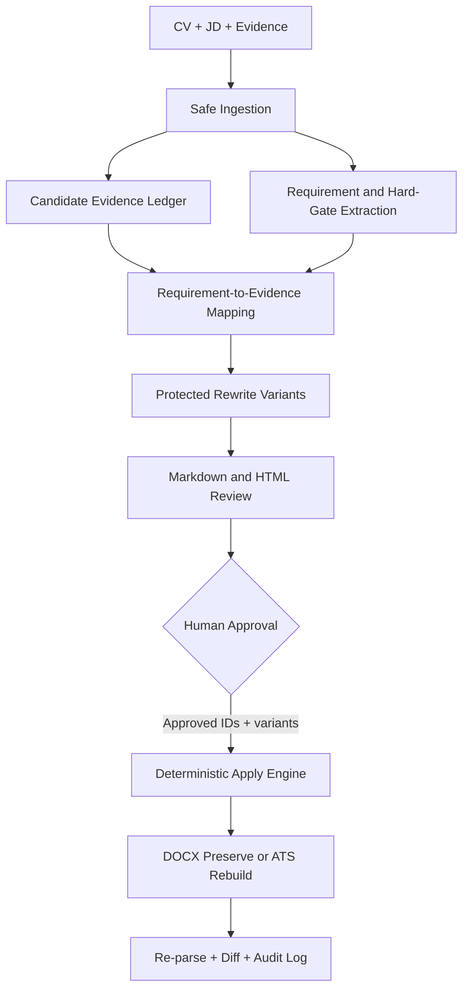

# Architecture

The intelligence layer may propose language, but evidence validation, approval, hashing, edit application, and final verification remain deterministic.

## Boundaries

- `ingestion.py` reads documents and reports quality.
- `evidence.py` owns candidate facts and provenance.
- `requirements.py` owns JD requirements, hard gates, and mappings.
- `rewriting.py` constructs safe variants from supported facts.
- `validation.py` prevents factual and ownership escalation.
- `documents.py` performs anchored edits.
- `workflow.py` coordinates the contract without bypassing a boundary.
