# Verified End-to-End Flow

Every arrow below was executed and observed on 2026-08-22 against a
realistic DOCX CV + evidence file + job description (see "Verification
run" at the end). This page maps what the tool *verifiably does today*,
not aspirations.

## Workflow diagram

```mermaid
flowchart TD
    Start(["Candidate starts tailor-cv<br/>(Claude /plugin, Codex skill, or CLI)"]) --> Door{"One door:<br/>ats-agent tailor<br/>(JD file · posting URL · ATS board · URL list)"}
    Door --> Eng{"ats-agent engine ready?"}
    Eng -- "no" --> Consent["ONE consent prompt:<br/>install engine via ordered chain<br/>PyPI → pinned GitHub tag → isolated venv"]
    Consent --> Doctor["doctor --strict verification<br/>+ install-state manifest"]
    Doctor --> Ready
    Eng -- "yes" --> Ready(["engine ready"])

    Ready --> Ingest["1 · INGEST<br/>CV (.docx/.pdf/.md/…) + job description<br/>+ evidence files — sha256 & format audit"]
    Ingest --> Ledger["2 · EVIDENCE LEDGER<br/>atomic claims · ownership level<br/>candidate-scoped provenance"]
    Ledger --> Req["3 · REQUIREMENTS<br/>clause extraction from JD bullets/sentences<br/>aliases: B.Com→bachelor · A/B-testing terms"]
    Req --> Map["4 · MATCH + HARD GATES<br/>direct / transferable / unsupported<br/>negation-aware: 'No A/B testing' ≠ coverage"]
    Map --> Gates{"Hard gate satisfied?"}
    Gates -- "no (e.g. work authorization)" --> Blocked["Blocked honestly —<br/>eligibility gap reported, nothing edited"]
    Gates -- "yes / not applicable" --> Propose["5 · PROPOSE<br/>surface-evidence changes with<br/>conservative / balanced / compact variants"]
    Map -. "unsupported JD terms" .-> Refused["REFUSED GAPS list<br/>(never inserted into the CV)"]
    Propose --> Summary["6 · CHAT SUMMARY (stderr)<br/>coverage table · changes with variants<br/>refused gaps · next-step commands"]
    Refused --> Summary
    Summary --> Approve{"Explicit approval?<br/>user names each change:variant"}
    Approve -- "none / refusal" --> Untouched(["Nothing changed.<br/>Source CV untouched"])
    Approve -- "yes — named subset only" --> Live{"Posting still live?<br/>(URL-sourced drafts)"}
    Live -- "dead" --> Dead["Blocked: nothing applied"]
    Live -- "changed / infra" --> Warn["⚠ warn (confirm if interactive)"]
    Warn --> Apply["7 · APPLY<br/>temp write → reparse → verify →<br/>atomic rename (source CV preserved)"]
    Live -- "same" --> Apply
    Apply --> Validate["8 · VALIDATE<br/>applied-change receipts · layout audit"]
    Validate --> Out(["Tailored CV delivered<br/>+ receipts and review bundle"])
```



## Text map


```text
 resume.docx ─┐
 evidence.md ─┼─► 1 INGEST ─► 2 EVIDENCE LEDGER ─┐
              │                                  │
 job.md (JD) ─┴─► 3 REQUIREMENTS ◄── aliases ─────┤
                       │                          │
                       ▼                          ▼
                 4 MAP + HARD GATES (negation-aware matching)
                       │
                       ▼
                 5 PROPOSE (variants, disavowal guard,
                            unique per-change anchors)
                       ▼
                 6 REVIEW bundles (md/html)
                       ▼
                 7 APPROVE  (explicit change IDs + variants,
                             bound to proposal digest)
                       ▼
                 8 APPLY  (transactional write, reparse)
                       ▼
                 9 VALIDATE (receipts, audit findings)
```

## Stage guarantees

| # | Stage | Verified behaviour | Enforced by |
|---|-------|--------------------|-------------|
| 1 | Ingest | TXT/MD/HTML/RTF/DOCX (+text PDF); sha256 + format diagnostics for every artifact | `ingestion.py`, `artifacts.py` |
| 2 | Evidence ledger | Atomic claims with ownership level and candidate-scoped provenance; duplicate/cross-candidate items rejected | `evidence.py` |
| 3 | Requirements | Sentence/bullet/semicolon clause extraction; alias table incl. degree spellings (B.Com→bachelor) and A/B-testing terms; **unpunctuated bullets kept** | `requirements.py:_segments`, `TERM_ALIASES` |
| 4 | Map + gates | direct / transferable / unsupported / conservative-unknown; hard gates (experience years, degrees, authorization); **aliases inside negation scopes ("No A/B testing experience") never count as coverage** | `map_requirements`, `evaluate_hard_gates` |
| 5 | Propose | Surface-evidence changes only where coverage exists; deterministic rewrite variants (conservative/balanced/compact when distinct); **disavowal lines are never surfaced into the CV**; sibling insertions receive distinct anchors so applies never conflict | `rewriting.py`, `providers.py` |
| 6 | Review | Markdown + HTML bundles; redacted mode for sharing | `review.py` |
| 7 | Approve | Manifest names proposal digest + each `change:variant`; digest mismatch blocks | `workflow.py` |
| 8 | Apply | Write-to-temp → reparse → verify → atomic rename; source CV untouched; existing outputs protected without `--force` | `documents.py`, `workflow.py` |
| 9 | Validate | Reparse output, extractable-text audit, applied-change receipts | `validation.py`, `cli.py validate` |

## Chat-first surface

`propose` prints a human summary to **stderr** (candidate, requirement
coverage with aggregated evidence counts, supported changes with variant
lists, refused gaps, and ready-to-paste next-step commands including the
exact `--select` tokens). stdout remains pure JSON for pipelines.
Suppress with `--no-summary`.

## Verification run (2026-08-22)

Fixture: 1-page DOCX resume (intern + volunteer analytics), supporting
`evidence.md` (including explicit non-evidence lines), JD with 15
extracted requirements across two sections.

| Check | Result |
|---|---|
| `propose` requirements extracted | 15 (was 3 before segmentation fix) |
| Coverage decisions | SQL/Power BI/dashboards direct; bachelor transferable via B.Com; a/b testing, aws, gcp correctly unsupported despite disavowal mentions |
| Supported changes / refused gaps | 5 / 7 |
| Multi-variant changes | 2 (conservative + balanced sentence-split) |
| approve → apply → validate | written → applied → valid |
| Disavowals leaked into output CV | none |
| Placement | internship evidence adjacent to its role bullets; volunteer evidence under Experience |
| Tests at time of writing | 178 passed (ruff + mypy clean) |

## Known limits

- Protected 60-case holdout gate is deferred for betas (banner on the
  release notes); mandatory for stable v1.0.0 (`--require-holdout`).
- PDF is input-only; DOCX output preserves structure but layout rendering
  is reported honestly as `rendered_layout: unverified`.
- `research-jobs` requires the local Scrapling CLI for public captures.
